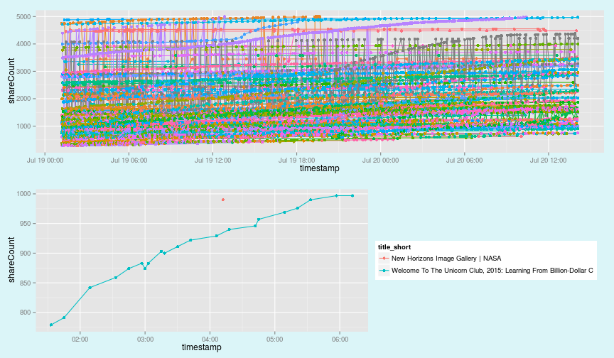
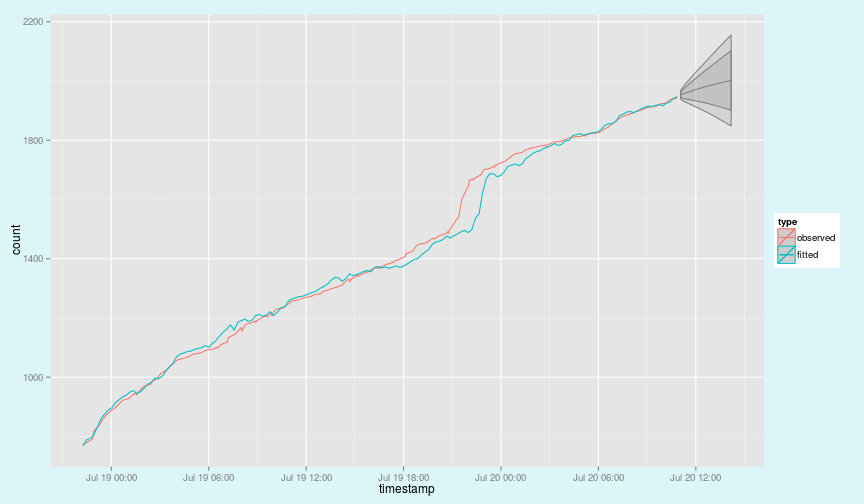

---
title       : Content Trend Explorer and Forecaster
subtitle    : Developing Data Products Coursera Course
author      : Sami Kallinen
job         : Student
framework   : impressjs        # {io2012, html5slides, shower, dzslides, ...}
highlighter : highlight.js  # {highlight.js, prettify, highlight}
hitheme     : tomorrow      # 
widgets     : []            # {mathjax, quiz, bootstrap}
mode        : selfcontained # {standalone, draft}
knit        : slidify::knit2slides

--- x:-1000 y:0 scale:5


# Exploring Tactical Content Trends and Forecasts  
## Developing Data Products Assignment*  
## Coursera Course by John Hopkings University    

*presentation by sami kallinen*
</br>
</br>
</br>


<span class="footnote">* The Assignment:
"OK, you've made your shiny app, now it's time to make your pitch. You get 5 slides (inclusive of the title slide)  to pitch a your app. You're going to create a web page using Slidify or Rstudio Presenter with an html5 slide deck."
</span>


---  x:0 y:2500 scale:4
## 1. Why?  
        
In a world of increasing **complexity and fragmentation**, with a plethora of **content** being published every second, we need new tools help us to **sift through this abundance** and make sense of the world. For any such tools, data is going to be central. This app was created as an experiment in the search of such tools. 


--- x:1500 y:4500 scale:3

## 2. What?
        
The [**Content Trend Explorer and Forecaster**](http://sakal.li/shinyapp) let's you explore data about how different content items are shared on social media. You can **apply different filters** to explore different aspects of the trending item. Filters include the following:

1. Defining minimum and maximum values for item **share count**.
1. Defining **share velocity**, ie. how many times the url has been shared per hour.
1. Defining **time period** by setting how many hours will be displayed.
1. Selecting **sources**. Narrowing down the sources to certain predefined types of tweeters.
1. You can also pick one item and isolate its trend plus **forecast** how it will be shared in the future.

--- x:2000 y:7500 z:2 rot:0 scale:2

## 3. How?
        
You can **isolate interesting items** by dynamically filtering them out of the data. The upper graph plots all items that have been shared less that 5000 times and have the share velocity of at least 10 shares per hour. The lower is limited to max 1000 shares and min 28 velocity.


```r
s <- data.frame(sCmax=c(5000,1000), sCmin=50, velocity=c(10,28))
p1 <- trendplot(pr, s[1,]); p2 <- trendplot(pr, s[2,]); multiplot(p1, p2)
```

 


--- x:8000 y:-1200 rot:160 scale:1

## 4. Forecasting
        
You can also pick **indvidual items**, explore them separately and **forecast** how they will be shared in the future. The method used is **exponential smoothing**. The 95% respective 80% confidence intervals are plotted.

 


[Go to the app!](http://sakal.li/shinyapp)

